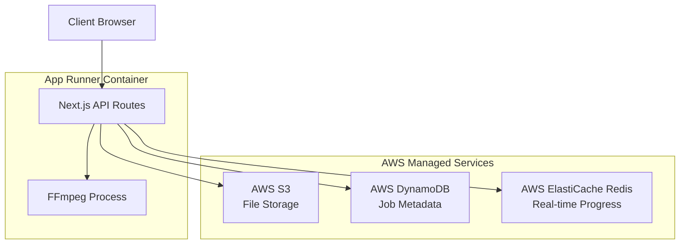
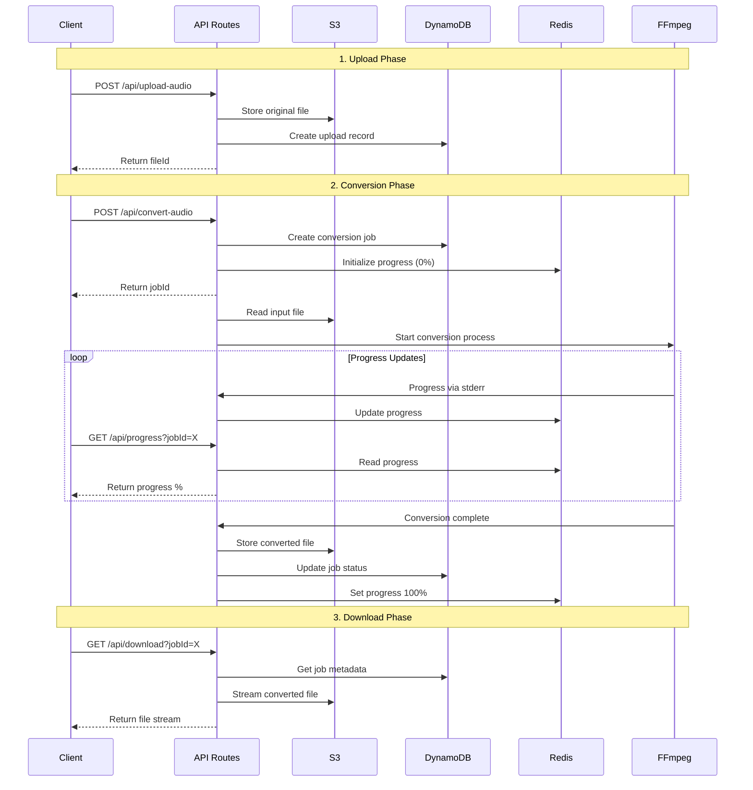
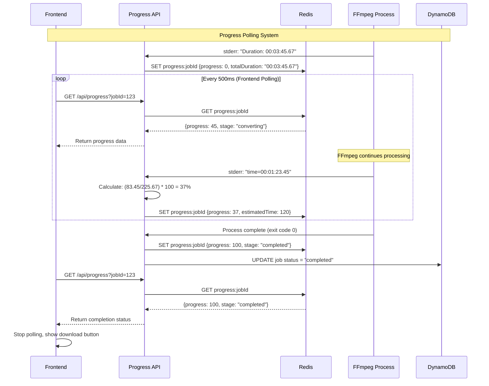

# Design Document

## Overview

This design implements a stateless, container-restart-resilient audio conversion system for AWS App Runner using S3 + DynamoDB + Redis architecture. The system decouples upload, conversion, and download processes to eliminate the current issues with in-memory state loss and container lifecycle dependencies.

## Architecture

### High-Level Architecture



### Process Flow



## Progress Polling Architecture

### Complete Progress Flow



### Progress API Endpoint Design

The `/api/progress` endpoint is the core component that handles frontend polling:

```typescript
// app/api/progress/route.ts
export async function GET(request: NextRequest) {
  const jobId = request.nextUrl.searchParams.get('jobId')
  
  try {
    // Primary: Read from Redis (fast, real-time)
    const progressData = await redis.get(`progress:${jobId}`)
    
    if (progressData) {
      return NextResponse.json(JSON.parse(progressData), {
        headers: {
          'Cache-Control': 'no-cache, no-store, must-revalidate',
          'Pragma': 'no-cache'
        }
      })
    }
    
    // Fallback: Read from DynamoDB (slower, but persistent)
    const job = await dynamodb.get({
      TableName: 'audio-conversion-jobs',
      Key: { jobId }
    }).promise()
    
    if (job.Item) {
      const fallbackProgress = {
        jobId,
        progress: job.Item.status === 'completed' ? 100 : 
                 job.Item.status === 'failed' ? -1 : 0,
        stage: job.Item.status,
        error: job.Item.error
      }
      
      return NextResponse.json(fallbackProgress)
    }
    
    // Job not found
    return NextResponse.json({ error: 'Job not found' }, { status: 404 })
    
  } catch (error) {
    console.error('Progress API error:', error)
    return NextResponse.json({ error: 'Failed to get progress' }, { status: 500 })
  }
}
```

### Frontend Polling Strategy

The frontend implements intelligent polling with exponential backoff:

```typescript
// Frontend polling logic
const pollProgress = async (jobId: string) => {
  let pollDelay = 500 // Start with 500ms
  const maxPollDelay = 5000 // Max 5 seconds
  let pollAttempts = 0
  
  const poll = async () => {
    try {
      const response = await fetch(`/api/progress?jobId=${jobId}`)
      const data = await response.json()
      
      setProgress(data.progress)
      
      if (data.progress >= 100) {
        // Conversion complete - stop polling
        return
      }
      
      if (data.progress === -1) {
        // Conversion failed - stop polling
        setError('Conversion failed')
        return
      }
      
      // Reset delay on successful response
      pollDelay = 500
      pollAttempts = 0
      
      // Schedule next poll
      setTimeout(poll, pollDelay)
      
    } catch (error) {
      // Exponential backoff on errors
      pollAttempts++
      pollDelay = Math.min(pollDelay * 1.5, maxPollDelay)
      
      if (pollAttempts < 10) {
        setTimeout(poll, pollDelay)
      } else {
        setError('Connection lost during conversion')
      }
    }
  }
  
  poll()
}
```

## Components and Interfaces

### 1. File Upload Service

**Purpose**: Handle chunked file uploads and store in S3

**Interface**:
```typescript
interface UploadService {
  uploadChunk(chunk: Buffer, metadata: ChunkMetadata): Promise<void>
  finalizeUpload(fileId: string): Promise<S3Location>
  validateFile(file: File): Promise<ValidationResult>
}

interface ChunkMetadata {
  fileId: string
  chunkIndex: number
  totalChunks: number
  fileName: string
}

interface S3Location {
  bucket: string
  key: string
  size: number
}
```

**Implementation**:
- Use S3 multipart upload for large files
- Store chunks with temporary keys
- Validate file format and size limits
- Clean up failed uploads automatically

### 2. Job Management Service

**Purpose**: Manage conversion job lifecycle in DynamoDB

**Interface**:
```typescript
interface JobService {
  createJob(input: JobInput): Promise<Job>
  getJob(jobId: string): Promise<Job | null>
  updateJobStatus(jobId: string, status: JobStatus): Promise<void>
  cleanupExpiredJobs(): Promise<void>
}

interface Job {
  jobId: string
  status: JobStatus
  inputS3Location: S3Location
  outputS3Location?: S3Location
  format: string
  quality: string
  createdAt: Date
  updatedAt: Date
  ttl: number
}

enum JobStatus {
  CREATED = 'created',
  PROCESSING = 'processing', 
  COMPLETED = 'completed',
  FAILED = 'failed'
}
```

**DynamoDB Schema**:
```typescript
{
  TableName: 'audio-conversion-jobs',
  KeySchema: [
    { AttributeName: 'jobId', KeyType: 'HASH' }
  ],
  AttributeDefinitions: [
    { AttributeName: 'jobId', AttributeType: 'S' }
  ],
  TimeToLiveSpecification: {
    AttributeName: 'ttl',
    Enabled: true
  }
}
```

### 3. Progress Tracking Service

**Purpose**: Real-time progress updates via Redis with frontend polling support

**Interface**:
```typescript
interface ProgressService {
  setProgress(jobId: string, progress: ProgressData): Promise<void>
  getProgress(jobId: string): Promise<ProgressData | null>
  subscribeToProgress(jobId: string): Promise<EventEmitter>
  initializeProgress(jobId: string): Promise<void>
  markComplete(jobId: string): Promise<void>
  markFailed(jobId: string, error: string): Promise<void>
}

interface ProgressData {
  jobId: string
  progress: number // 0-100
  stage: string
  estimatedTimeRemaining?: number
  error?: string
  startTime?: number
  currentTime?: string
  totalDuration?: string
}
```

**Progress Update Flow**:
1. **Initialization**: When conversion starts, set progress to 0% in Redis
2. **FFmpeg Parsing**: Parse stderr output for time/duration information
3. **Calculation**: Calculate percentage based on current_time/total_duration
4. **Storage**: Store in Redis with TTL
5. **Polling Response**: API endpoint reads from Redis and returns to frontend

**Redis Schema**:
```typescript
// Key: `progress:${jobId}`
// Value: JSON.stringify(ProgressData)
// TTL: 3600 seconds (1 hour)

// Pub/Sub Channel: `job:${jobId}` (optional for real-time updates)
// Message: ProgressData updates
```

**API Endpoint for Progress Polling**:
```typescript
// GET /api/progress?jobId=123
export async function GET(request: NextRequest) {
  const jobId = request.nextUrl.searchParams.get('jobId')
  
  // Try Redis first (fast)
  let progress = await progressService.getProgress(jobId)
  
  // Fallback to DynamoDB if Redis expired
  if (!progress) {
    const job = await jobService.getJob(jobId)
    progress = {
      jobId,
      progress: job?.status === 'completed' ? 100 : 0,
      stage: job?.status || 'unknown'
    }
  }
  
  return NextResponse.json(progress)
}
```

### 4. Streaming FFmpeg Conversion Service (Experimental)

**Purpose**: Handle audio conversion using streaming architecture to eliminate local file storage

**Interface**:
```typescript
interface ConversionService {
  streamingConvertAudio(job: Job, progressCallback: ProgressCallback): Promise<S3Location>
  fallbackFileConversion(job: Job, progressCallback: ProgressCallback): Promise<S3Location>
  parseFFmpegProgress(stderr: string): ProgressData
  validateStreamingSupport(format: string): boolean
  validateFFmpegInstallation(): Promise<boolean>
}

type ProgressCallback = (progress: ProgressData) => Promise<void>
```

**Streaming Architecture Implementation**:
```typescript
class StreamingConversionService {
  async streamingConvertAudio(job: Job, progressCallback: ProgressCallback): Promise<S3Location> {
    // Stream from S3 → FFmpeg → S3 without local storage
    const s3InputStream = this.s3.getObject({
      Bucket: job.inputS3Location.bucket,
      Key: job.inputS3Location.key
    }).createReadStream()
    
    const outputKey = `conversions/${job.jobId}.${job.format}`
    const s3Upload = this.s3.upload({
      Bucket: job.inputS3Location.bucket,
      Key: outputKey,
      Body: null // Will be set to FFmpeg stdout stream
    })
    
    // FFmpeg process with streaming I/O
    const ffmpeg = spawn('ffmpeg', [
      '-i', 'pipe:0',           // Read from stdin
      '-b:a', job.quality,
      '-f', job.format,
      'pipe:1'                  // Write to stdout
    ])
    
    // Connect streams: S3 → FFmpeg → S3
    s3InputStream.pipe(ffmpeg.stdin)
    s3Upload.Body = ffmpeg.stdout
    
    // Monitor progress via stderr
    ffmpeg.stderr.on('data', (data) => {
      const progressData = this.parseFFmpegProgress(data.toString(), job.jobId)
      if (progressData) {
        progressCallback(progressData)
      }
    })
    
    // Handle completion and errors
    return new Promise((resolve, reject) => {
      s3Upload.promise()
        .then(() => resolve({ bucket: job.inputS3Location.bucket, key: outputKey }))
        .catch(reject)
    })
  }
  
  // Fallback to local file processing if streaming fails
  async fallbackFileConversion(job: Job, progressCallback: ProgressCallback): Promise<S3Location> {
    // Download to /tmp, process, upload, cleanup
    // This is the traditional approach with careful resource management
  }
}
}
```

**Conversion Flow with Progress Updates**:
1. Initialize progress at 0% in Redis
2. Start FFmpeg process with stderr monitoring
3. Parse each stderr line for progress information
4. Update Redis with calculated percentage
5. Frontend polls `/api/progress` endpoint
6. When complete, set progress to 100% in Redis

### 5. Download Service

**Purpose**: Serve converted files from S3

**Interface**:
```typescript
interface DownloadService {
  streamFile(jobId: string): Promise<ReadableStream>
  generatePresignedUrl(jobId: string): Promise<string>
  validateDownloadAccess(jobId: string): Promise<boolean>
}
```

## Data Models

### S3 Bucket Structure
```
audio-conversion-bucket/
├── uploads/
│   ├── {fileId}.{ext}           # Original uploaded files
│   └── chunks/
│       └── {fileId}/            # Multipart upload chunks
│           ├── part-1
│           └── part-2
└── conversions/
    └── {jobId}.{format}         # Converted output files
```

### DynamoDB Job Record
```typescript
{
  jobId: "1754408209622",
  status: "completed",
  inputS3Location: {
    bucket: "audio-conversion-bucket",
    key: "uploads/audio-123.mp3",
    size: 33554432
  },
  outputS3Location: {
    bucket: "audio-conversion-bucket", 
    key: "conversions/1754408209622.wav",
    size: 167772160
  },
  format: "wav",
  quality: "192k",
  createdAt: "2025-01-05T15:30:09.622Z",
  updatedAt: "2025-01-05T15:32:15.891Z",
  ttl: 1754494609  // 24 hours from creation
}
```

### Redis Progress Data
```typescript
{
  jobId: "1754408209622",
  progress: 75,
  stage: "converting",
  estimatedTimeRemaining: 30,
  currentTime: "00:01:45.23",
  totalDuration: "00:07:01.45"
}
```

## Error Handling

### Error Categories and Responses

1. **Upload Errors**
   - File too large: HTTP 413 with retry guidance
   - Invalid format: HTTP 400 with supported formats
   - S3 upload failure: HTTP 503 with retry after delay

2. **Conversion Errors**
   - FFmpeg not found: HTTP 500 with installation guidance
   - FFmpeg process crash: HTTP 500 with diagnostic info
   - FFmpeg timeout: HTTP 408 with job cancellation
   - Insufficient disk space: HTTP 507 with cleanup

3. **AWS Service Errors**
   - S3 access denied: HTTP 403 with permission guidance
   - DynamoDB throttling: HTTP 429 with backoff
   - Redis connection failure: Fallback to DynamoDB

4. **Container Restart Recovery**
   - Detect orphaned jobs on startup
   - Resume or mark as failed based on age
   - Clean up temporary resources

### Retry Strategies

```typescript
interface RetryConfig {
  maxRetries: number
  baseDelay: number
  maxDelay: number
  backoffMultiplier: number
}

const AWS_RETRY_CONFIG: RetryConfig = {
  maxRetries: 3,
  baseDelay: 1000,
  maxDelay: 10000,
  backoffMultiplier: 2
}
```

## Testing Strategy

### Unit Tests
- Service layer methods with mocked AWS clients
- FFmpeg progress parsing with various stderr formats
- Error handling scenarios and retry logic
- File validation and format detection

### Integration Tests
- End-to-end upload → conversion → download flow
- AWS service integration with LocalStack
- Container restart simulation
- Concurrent job processing

### Environment-Specific Tests

1. **Local Development**
   - Use LocalStack for S3 and DynamoDB
   - Use local Redis instance
   - Mock FFmpeg for fast testing

2. **Docker Testing**
   - Full containerized environment
   - Simulate container restarts
   - Test resource limits and cleanup

3. **App Runner Testing**
   - Deploy to staging environment
   - Test with real AWS services
   - Monitor container scaling behavior
   - Validate CORS and ACL configurations

### Performance Testing
- Large file handling (up to 200MB)
- Concurrent conversion limits
- Memory usage monitoring
- Progress update frequency optimization

## Multi-Environment Configuration

### Environment Detection
```typescript
enum Environment {
  LOCAL = 'local',
  DOCKER = 'docker', 
  APP_RUNNER = 'app-runner'
}

interface EnvironmentConfig {
  s3: S3Config
  dynamodb: DynamoDBConfig
  redis: RedisConfig
  ffmpeg: FFmpegConfig
}
```

### Service Configurations

**Local Development**:
```typescript
{
  s3: {
    endpoint: 'http://localhost:4566', // LocalStack
    region: 'us-east-1',
    credentials: { accessKeyId: 'test', secretAccessKey: 'test' }
  },
  dynamodb: {
    endpoint: 'http://localhost:8000', // DynamoDB Local
    region: 'us-east-1'
  },
  redis: {
    host: 'localhost',
    port: 6379
  }
}
```

**Docker Environment**:
```typescript
{
  s3: {
    endpoint: 'http://localstack:4566',
    region: 'us-east-1'
  },
  dynamodb: {
    endpoint: 'http://dynamodb-local:8000',
    region: 'us-east-1'
  },
  redis: {
    host: 'redis',
    port: 6379
  }
}
```

**App Runner Production**:
```typescript
{
  s3: {
    region: process.env.AWS_REGION,
    // Uses IAM role credentials automatically
  },
  dynamodb: {
    region: process.env.AWS_REGION
  },
  redis: {
    host: process.env.REDIS_ENDPOINT,
    port: 6379,
    tls: true
  }
}
```