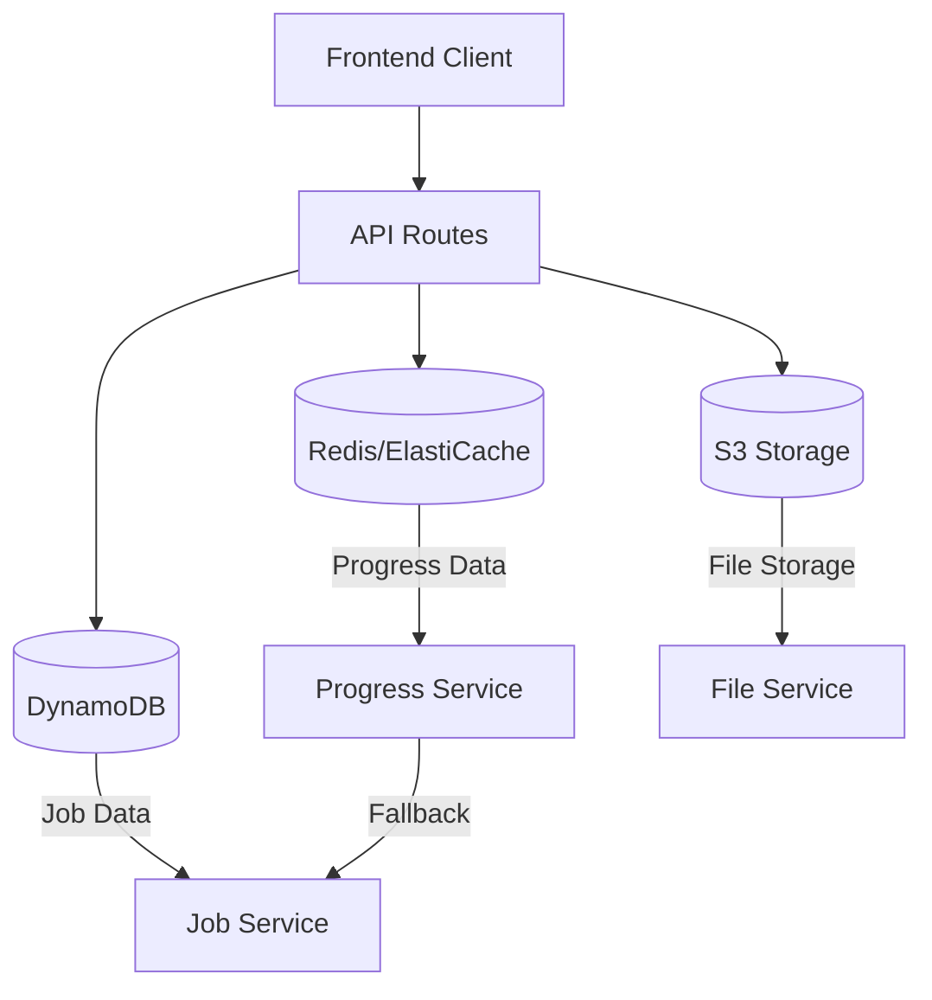
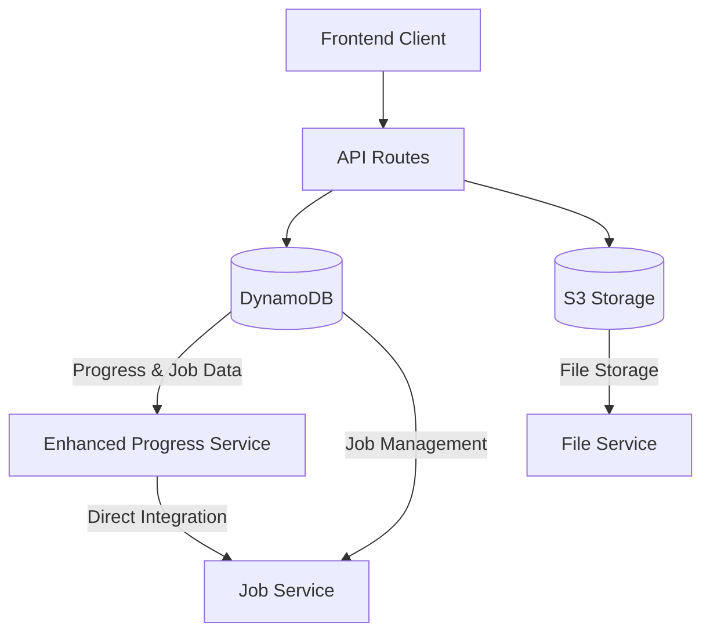

# Design Document

## Overview

This design outlines the complete removal of Redis/ElastiCache dependency from the TinyPixo audio conversion application and the rewiring of all components to use only S3 and DynamoDB. The new architecture will eliminate VPC connectivity issues while maintaining all existing functionality including real-time progress tracking, chunked file uploads, audio conversion monitoring, and automatic cleanup.

The design focuses on creating a Redis-free system that leverages DynamoDB's TTL capabilities for automatic cleanup and S3's multipart upload features for progress tracking, ensuring the application works reliably across all deployment environments.

## Architecture

### Current Architecture (Redis-Dependent)


### New Architecture (Redis-Free)


### Data Flow Changes

#### Upload Progress Tracking
**Before (Redis):**
1. Client uploads file chunks
2. Backend stores progress in Redis with TTL
3. Frontend polls Redis via API
4. Progress data expires automatically

**After (DynamoDB):**
1. Client uploads file chunks
2. Backend stores progress in DynamoDB with TTL attribute
3. Frontend polls DynamoDB via API
4. DynamoDB TTL automatically removes expired records

#### Audio Conversion Progress
**Before (Redis + DynamoDB):**
1. FFmpeg progress updates stored in Redis
2. Job status stored in DynamoDB
3. Frontend gets real-time data from Redis
4. Falls back to DynamoDB job status

**After (DynamoDB Only):**
1. FFmpeg progress updates stored directly in DynamoDB
2. Job status and progress in same record
3. Frontend gets data from DynamoDB
4. Single source of truth for all progress data

## Components and Interfaces

### Enhanced Progress Service

The `ProgressService` will be completely rewritten to use DynamoDB as the primary and only storage mechanism.

#### New Progress Data Model
```typescript
interface ProgressData {
  jobId: string                    // Partition key
  progress: number                 // 0-100 percentage
  stage: string                   // 'uploading', 'converting', 'completed', 'failed'
  estimatedTimeRemaining?: number
  error?: string
  startTime?: number
  currentTime?: string
  totalDuration?: string
  uploadedSize?: number           // For upload progress
  totalSize?: number              // For upload progress
  completedChunks?: number        // For chunked uploads
  totalChunks?: number            // For chunked uploads
  ttl: number                     // TTL timestamp for automatic cleanup
  updatedAt: number               // Last update timestamp
}
```

#### New Progress Service Interface
```typescript
class ProgressService {
  // Core progress operations
  async initializeProgress(jobId: string): Promise<void>
  async setProgress(jobId: string, progressData: ProgressData): Promise<void>
  async getProgress(jobId: string): Promise<ProgressData | null>
  async markComplete(jobId: string): Promise<void>
  async markFailed(jobId: string, error: string): Promise<void>
  
  // Upload-specific progress
  async setUploadProgress(fileId: string, uploadData: UploadProgressData): Promise<void>
  async getUploadProgress(fileId: string): Promise<UploadProgressData | null>
  
  // FFmpeg integration
  async processFFmpegStderr(jobId: string, stderrLine: string, processInfo: FFmpegProcessInfo): Promise<void>
  
  // Cleanup (now DynamoDB-based)
  async cleanupExpiredProgress(): Promise<void>
}
```

### Upload Progress Data Model

A new DynamoDB table for upload progress tracking:

```typescript
interface UploadProgressData {
  fileId: string                  // Partition key
  fileName: string
  totalSize: number
  uploadedSize: number
  totalChunks: number
  completedChunks: number
  stage: 'uploading' | 'completed' | 'failed'
  uploadId?: string               // S3 multipart upload ID
  s3Key?: string                  // S3 object key
  bucketName?: string             // S3 bucket name
  parts?: Array<{ETag: string; PartNumber: number}>  // S3 multipart parts
  ttl: number                     // TTL timestamp
  updatedAt: number               // Last update timestamp
}
```

### Modified Job Service

The `JobService` will be enhanced to handle progress data directly:

```typescript
interface Job {
  jobId: string                   // Partition key
  status: JobStatus
  inputS3Location: S3Location
  outputS3Location?: S3Location
  format: string
  quality: string
  progress?: number               // Integrated progress tracking
  stage?: string                  // Current processing stage
  error?: string
  createdAt: Date
  updatedAt: Date
  ttl: number                     // TTL timestamp
}
```

### Environment Configuration Updates

Remove Redis configuration entirely:

```typescript
interface EnvironmentConfig {
  environment: Environment
  s3: S3Config
  dynamodb: DynamoDBConfig
  // Redis configuration removed
}
```

## Data Models

### DynamoDB Tables

#### 1. Progress Table (`audio-conversion-progress`)
- **Partition Key:** `progressId` (string) - Can be jobId or fileId
- **Attributes:**
  - `progressType` (string) - 'job' or 'upload'
  - `progress` (number) - 0-100 percentage
  - `stage` (string) - Current stage
  - `data` (map) - Stage-specific data
  - `ttl` (number) - TTL timestamp
  - `updatedAt` (number) - Last update timestamp

#### 2. Enhanced Jobs Table (`audio-conversion-jobs`)
- **Partition Key:** `jobId` (string)
- **Attributes:** (existing attributes plus)
  - `progress` (number) - Current progress percentage
  - `stage` (string) - Current processing stage
  - `progressData` (map) - Detailed progress information

#### 3. Upload Sessions Table (`audio-conversion-uploads`)
- **Partition Key:** `fileId` (string)
- **Attributes:**
  - `fileName` (string)
  - `totalSize` (number)
  - `uploadedSize` (number)
  - `totalChunks` (number)
  - `completedChunks` (number)
  - `stage` (string)
  - `s3Data` (map) - S3-related information
  - `ttl` (number) - TTL timestamp
  - `updatedAt` (number)

### S3 Storage Structure

No changes to S3 structure - continues to store:
- `uploads/` - Original uploaded files
- `conversions/` - Converted audio files
- Metadata includes file information and processing details

## Error Handling

### DynamoDB Error Handling
```typescript
class DynamoDBProgressService {
  private async executeWithRetry<T>(operation: () => Promise<T>): Promise<T> {
    const maxRetries = 3
    const baseDelay = 500
    
    for (let attempt = 0; attempt <= maxRetries; attempt++) {
      try {
        return await operation()
      } catch (error) {
        if (attempt === maxRetries) throw error
        
        const delay = baseDelay * Math.pow(2, attempt)
        await new Promise(resolve => setTimeout(resolve, delay))
      }
    }
  }
}
```

### Graceful Degradation
- If DynamoDB is temporarily unavailable, return cached job status
- If progress updates fail, continue processing without breaking the conversion
- Provide meaningful error messages for different failure scenarios

### Error Recovery
- Implement automatic retry with exponential backoff
- Handle throttling and capacity issues gracefully
- Maintain operation logs for debugging

## Testing Strategy

### Unit Testing
- Mock DynamoDB operations for all progress service tests
- Test TTL calculation and automatic cleanup logic
- Verify error handling and retry mechanisms
- Test upload progress tracking with chunked uploads

### Integration Testing with Live AWS Services
- Test against real DynamoDB tables with TTL enabled
- Verify S3 multipart upload progress tracking
- Test automatic cleanup of expired records
- Validate performance under load

### Test Data Management
- Use separate DynamoDB tables for testing
- Implement test data cleanup procedures
- Mock S3 operations where appropriate
- Test with various file sizes and formats

### Performance Testing
- Measure DynamoDB response times for progress queries
- Test concurrent upload progress tracking
- Verify TTL-based cleanup performance
- Compare performance with previous Redis implementation

## Migration Strategy

### Phase 1: Preparation
1. Create new DynamoDB tables with TTL enabled
2. Implement new progress service with DynamoDB backend
3. Update environment configuration to remove Redis
4. Create migration scripts for existing data

### Phase 2: Implementation
1. Replace Redis calls with DynamoDB operations
2. Update upload progress tracking to use DynamoDB
3. Modify FFmpeg progress parsing to write to DynamoDB
4. Update API routes to use new progress service

### Phase 3: Testing and Validation
1. Test each component against live AWS services
2. Validate progress tracking accuracy
3. Verify automatic cleanup functionality
4. Performance testing and optimization

### Phase 4: Deployment
1. Deploy to staging environment
2. Run comprehensive tests
3. Deploy to production
4. Monitor performance and error rates

## Trade-offs: DynamoDB vs Redis

### Advantages of Moving to DynamoDB-Only

**Deployment Simplicity:**
- No VPC connectivity issues with App Runner
- No Redis cluster management or maintenance
- Simplified infrastructure with fewer moving parts
- No ElastiCache security group configurations

**Reliability:**
- AWS-managed service with built-in redundancy
- Automatic backups and point-in-time recovery
- No single point of failure from Redis connection issues
- Better integration with other AWS services

**Cost Predictability:**
- Pay-per-request pricing model available
- No need to provision Redis instances
- Automatic scaling without capacity planning

### Disadvantages of Moving Away from Redis

**Performance Impact:**
- **Latency:** DynamoDB typically has 1-10ms latency vs Redis sub-millisecond
- **Throughput:** Redis can handle 100k+ ops/sec vs DynamoDB's lower limits
- **Real-time Updates:** Less suitable for high-frequency progress updates

**Functionality Limitations:**
- **No Pub/Sub:** Cannot implement real-time notifications easily
- **Limited Data Structures:** No Redis sets, lists, or atomic operations
- **No Lua Scripts:** Cannot execute complex atomic operations
- **Caching:** DynamoDB is not optimized for caching use cases

**Cost Considerations:**
- **Read/Write Costs:** Each progress update costs money vs Redis memory operations
- **Frequent Updates:** High-frequency progress updates can be expensive
- **Query Costs:** Each progress check incurs charges

### Specific Impact on Our Application

**Progress Tracking:**
- **Before:** Sub-second Redis updates, instant retrieval
- **After:** 1-5ms DynamoDB updates, slightly slower but acceptable for user experience
- **Mitigation:** Implement client-side progress smoothing and reasonable polling intervals

**Upload Progress:**
- **Before:** Real-time chunk progress in Redis
- **After:** DynamoDB updates per chunk (more expensive but manageable)
- **Mitigation:** Batch progress updates for small chunks, update every few chunks instead of every chunk

**Conversion Progress:**
- **Before:** FFmpeg stderr parsing with Redis storage
- **After:** Same parsing but DynamoDB storage with throttling
- **Mitigation:** Throttle progress updates to every 1-2 seconds instead of every stderr line

**Memory Usage:**
- **Before:** Redis keeps all progress data in memory
- **After:** DynamoDB stores on disk, no memory pressure
- **Impact:** Slightly slower access but better for long-running processes

### Recommended Optimizations

**Progress Update Throttling:**
```typescript
// Instead of updating on every FFmpeg stderr line
if (Date.now() - lastUpdate > 1000) { // Update max once per second
  await progressService.setProgress(jobId, progressData)
}
```

**Batch Operations:**
```typescript
// Batch multiple progress updates
const updates = []
updates.push(progressUpdate1, progressUpdate2, progressUpdate3)
await dynamodbClient.batchWrite(updates)
```

**Client-Side Smoothing:**
```typescript
// Frontend interpolates between progress updates
const smoothProgress = interpolateProgress(lastKnownProgress, currentTime)
```

### When This Trade-off Makes Sense

**Good for:**
- Production reliability over absolute performance
- Simplified deployment and maintenance
- Applications where 1-5ms latency is acceptable
- Teams without Redis expertise
- Cost-predictable workloads

**Not Ideal for:**
- Real-time gaming or chat applications
- High-frequency trading systems
- Applications requiring sub-millisecond latency
- Heavy caching workloads
- Complex atomic operations

### Our Decision Rationale

For TinyPixo's audio conversion use case:
- **User Experience:** 1-2 second progress updates are perfectly acceptable
- **Reliability:** More important than microsecond performance gains
- **Deployment:** Eliminating VPC complexity is worth the performance trade-off
- **Scale:** Our workload doesn't require Redis-level performance
- **Maintenance:** Simpler architecture reduces operational overhead

## Performance Considerations

### DynamoDB Optimization
- Use on-demand billing for variable workloads
- Implement efficient query patterns
- Batch operations where possible
- Monitor consumed capacity and throttling

### Caching Strategy
- Implement in-memory caching for frequently accessed progress data
- Use short TTL for cached data (30-60 seconds)
- Cache job status to reduce DynamoDB queries

### Query Optimization
- Use consistent reads only when necessary
- Implement pagination for large result sets
- Use projection expressions to limit returned data
- Monitor query performance and optimize as needed

## Security Considerations

### Access Control
- Use IAM roles with minimal required permissions
- Separate read and write permissions where possible
- Implement resource-based policies for DynamoDB tables

### Data Protection
- Enable encryption at rest for DynamoDB tables
- Use HTTPS for all API communications
- Implement proper input validation and sanitization

### Monitoring and Auditing
- Enable CloudTrail for API access logging
- Monitor DynamoDB metrics and alarms
- Implement application-level logging for debugging

## Deployment Configuration

### Environment Variables
Remove Redis-related variables:
```bash
# Remove these:
# REDIS_ENDPOINT
# REDIS_PORT
# REDIS_TLS

# Keep these:
AWS_REGION=us-east-1
S3_BUCKET_NAME=audio-conversion-app-bucket
DYNAMODB_PROGRESS_TABLE=audio-conversion-progress
DYNAMODB_UPLOADS_TABLE=audio-conversion-uploads
```

### DynamoDB Table Configuration
```typescript
const progressTableConfig = {
  TableName: 'audio-conversion-progress',
  KeySchema: [{ AttributeName: 'progressId', KeyType: 'HASH' }],
  AttributeDefinitions: [{ AttributeName: 'progressId', AttributeType: 'S' }],
  BillingMode: 'PAY_PER_REQUEST',
  TimeToLiveSpecification: {
    AttributeName: 'ttl',
    Enabled: true
  }
}
```

### App Runner Configuration
Updated `apprunner.yaml` with Redis variables removed and DynamoDB table names added.

## Monitoring and Observability

### Metrics to Track
- DynamoDB read/write capacity consumption
- Progress update latency
- Upload success/failure rates
- TTL-based cleanup effectiveness
- API response times

### Logging Strategy
- Structured logging with correlation IDs
- Progress update events
- Error conditions and recovery actions
- Performance metrics

### Alerting
- DynamoDB throttling alerts
- High error rate alerts
- Progress tracking failures
- Cleanup job failures

This design ensures a complete transition from Redis to a DynamoDB-only architecture while maintaining all existing functionality and improving reliability in cloud deployment scenarios.