# Audio Conversion App - Complete Data Flow & Design Architecture

## 🎯 Overview

This document provides a comprehensive visual representation of the audio conversion application's data flow, architecture, and design using Mermaid diagrams.

## 🏗️ System Architecture

```mermaid
graph LR
    subgraph "Frontend Layer"
        UI[Audio Upload UI]
        Controls[Audio Controls]
        Preview[Audio Preview]
        Progress[Progress Display]
    end
    
    subgraph "API Layer"
        UploadAPI[Upload Audio API]
        ConvertAPI[Convert Audio API]
        ProgressAPI[Progress API]
        DownloadAPI[Download API]
    end
    
    subgraph "Service Layer"
        SmartTemp[Smart Temp Files Service]
        S3Upload[S3 Upload Service]
        JobService[Job Service]
        ProgressService[Progress Service]
    end
    
    subgraph "Processing Layer"
        FFmpeg[FFmpeg Process]
        TempFiles[/tmp/ Directory]
    end
    
    subgraph "Storage Layer"
        S3[(AWS S3)]
        DynamoDB[(DynamoDB)]
        Uploads[S3: uploads/]
        Conversions[S3: conversions/]
    end
    
    UI --> UploadAPI
    Controls --> ConvertAPI
    Progress --> ProgressAPI
    Preview --> DownloadAPI
    
    UploadAPI --> S3Upload
    ConvertAPI --> SmartTemp
    ProgressAPI --> ProgressService
    DownloadAPI --> S3
    
    SmartTemp --> FFmpeg
    SmartTemp --> TempFiles
    SmartTemp --> S3Upload
    
    S3Upload --> S3
    JobService --> DynamoDB
    ProgressService --> DynamoDB
    
    S3 --> Uploads
    S3 --> Conversions
```

## 📊 Complete Data Flow

```mermaid
sequenceDiagram
    participant User
    participant Frontend
    participant UploadAPI
    participant S3
    participant ConvertAPI
    participant SmartTemp
    participant FFmpeg
    participant TempFiles
    participant ProgressAPI
    participant DynamoDB
    participant DownloadAPI
    
    Note over User, DownloadAPI: Phase 1: File Upload
    User->>Frontend: Select audio file (≤105MB)
    Frontend->>Frontend: Validate file size
    Frontend->>UploadAPI: POST /api/upload-audio
    UploadAPI->>UploadAPI: Validate file (105MB limit)
    UploadAPI->>S3: Stream upload to uploads/
    S3-->>UploadAPI: Upload complete
    UploadAPI-->>Frontend: Return fileId
    Frontend-->>User: Show upload success
    
    Note over User, DownloadAPI: Phase 2: Conversion Request
    User->>Frontend: Click "Convert Audio"
    Frontend->>ConvertAPI: POST /api/convert-audio
    ConvertAPI->>ConvertAPI: Validate file size (105MB)
    ConvertAPI->>DynamoDB: Create job record
    ConvertAPI->>DynamoDB: Initialize progress
    ConvertAPI-->>Frontend: Return jobId (202 Accepted)
    
    Note over User, DownloadAPI: Phase 3: Background Conversion
    ConvertAPI->>SmartTemp: Start conversion process
    SmartTemp->>S3: Stream download to temp file
    S3-->>TempFiles: /tmp/jobId-input.ext
    SmartTemp->>ProgressAPI: Update progress (Phase 2: Download)
    
    SmartTemp->>FFmpeg: Convert temp file to temp file
    FFmpeg-->>TempFiles: /tmp/jobId-output.ext
    SmartTemp->>ProgressAPI: Update progress (Phase 2: Convert)
    
    SmartTemp->>S3: Stream upload from temp file
    TempFiles-->>S3: conversions/jobId.ext
    SmartTemp->>ProgressAPI: Update progress (Phase 3: Upload)
    
    SmartTemp->>TempFiles: Cleanup temp files
    SmartTemp->>DynamoDB: Mark job complete
    SmartTemp->>ProgressAPI: Mark progress complete
    
    Note over User, DownloadAPI: Phase 4: Download
    Frontend->>ProgressAPI: Poll progress
    ProgressAPI->>DynamoDB: Get progress data
    DynamoDB-->>ProgressAPI: Progress: 100%
    ProgressAPI-->>Frontend: Conversion complete
    Frontend-->>User: Show download button
    
    User->>Frontend: Click download
    Frontend->>DownloadAPI: GET /api/download
    DownloadAPI->>S3: Generate presigned URL
    S3-->>DownloadAPI: Presigned URL
    DownloadAPI-->>Frontend: Return download URL
    Frontend-->>User: Trigger download
```



## 🔄 Smart Temporary Files Flow

```mermaid
flowchart TD
    Start([Conversion Request]) --> Validate{File Size ≤ 105MB?}
    
    Validate -->|No| Error[Return 413 Error]
    Validate -->|Yes| CreateJob[Create Job in DynamoDB]
    
    CreateJob --> InitProgress[Initialize Progress Tracking]
    InitProgress --> StartConversion[Start Background Conversion]
    
    StartConversion --> Phase1[Phase 1: S3 → Temp File]
    Phase1 --> Download[Stream S3 to /tmp/jobId-input.ext]
    Download --> UpdateP1[Update Progress: Downloading]
    
    UpdateP1 --> Phase2[Phase 2: FFmpeg Conversion]
    Phase2 --> FFmpegConvert[FFmpeg: input.ext → output.ext]
    FFmpegConvert --> UpdateP2[Update Progress: Converting]
    
    UpdateP2 --> Phase3[Phase 3: Temp File → S3]
    Phase3 --> Upload[Stream /tmp/jobId-output.ext → S3]
    Upload --> UpdateP3[Update Progress: Uploading]
    
    UpdateP3 --> Cleanup[Delete Temp Files]
    Cleanup --> Complete[Mark Job Complete]
    Complete --> End([Conversion Complete])
    
    Error --> End
    
    style Phase1 fill:#e1f5fe
    style Phase2 fill:#f3e5f5
    style Phase3 fill:#e8f5e8
    style Cleanup fill:#fff3e0
```



## 📱 Frontend Component Architecture


## 🗄️ Database Schema & Relationships


## 🔧 Service Layer Architecture


## 📊 Progress Tracking System


## 🔒 File Size Validation Flow

```mermaid
flowchart TD
    FileSelect[User Selects File] --> FrontendCheck{Frontend: Size ≤ 105MB?}
    
    FrontendCheck -->|No| FrontendError[Show Error: File too large]
    FrontendCheck -->|Yes| UploadAttempt[Attempt Upload]
    
    UploadAttempt --> UploadAPICheck{Upload API: Size ≤ 105MB?}
    UploadAPICheck -->|No| UploadError[Return 400: File too large]
    UploadAPICheck -->|Yes| S3Upload[Upload to S3]
    
    S3Upload --> ConvertRequest[User Requests Conversion]
    ConvertRequest --> ConvertAPICheck{Convert API: Size ≤ 105MB?}
    
    ConvertAPICheck -->|No| ConvertError[Return 413: File too large]
    ConvertAPICheck -->|Yes| StartConversion[Start Conversion Process]
    
    StartConversion --> ConversionCheck{Conversion Service: Size ≤ 105MB?}
    ConversionCheck -->|No| ConversionError[Mark Job Failed]
    ConversionCheck -->|Yes| ProcessFile[Process File Successfully]
    
    FrontendError --> End[End]
    UploadError --> End
    ConvertError --> End
    ConversionError --> End
    ProcessFile --> Success[Conversion Success]
    Success --> End
    
    style FrontendCheck fill:#e3f2fd
    style UploadAPICheck fill:#e8f5e8
    style ConvertAPICheck fill:#fff3e0
    style ConversionCheck fill:#fce4ec
```



## 💾 Memory Usage Optimization


## 🔧 Backend Architecture (Horizontal Layout)


## 🚀 Deployment Architecture

```mermaid
graph LR
    subgraph "Client Layer"
        User[Users]
        CDN[CloudFront CDN<br/>(Optional)]
    end
    
    subgraph "Application Layer"
        AppRunner[AWS App Runner<br/>Next.js Application]
        Lambda[Lambda Functions<br/>(Optional)]
    end
    
    subgraph "Storage Layer"
        S3Bucket[S3 Bucket<br/>uploads/ & conversions/]
        DynamoTables[DynamoDB Tables<br/>jobs, progress, uploads]
    end
    
    subgraph "Monitoring Layer"
        CloudWatch[CloudWatch Logs]
        Metrics[CloudWatch Metrics]
    end
    
    User --> CDN
    CDN --> AppRunner
    User -.-> AppRunner
    
    AppRunner --> S3Bucket
    AppRunner --> DynamoTables
    AppRunner --> CloudWatch
    AppRunner --> Metrics
    
    style AppRunner fill:#e3f2fd
    style S3Bucket fill:#e8f5e8
    style DynamoTables fill:#fff3e0
```

## 🔄 Error Handling & Recovery


## 📈 Performance Metrics


---

## 🎯 Summary

This comprehensive data flow and design document illustrates:

- **Complete system architecture** with all components and their relationships
- **Detailed data flow** from file upload to download
- **Smart temporary files implementation** that eliminates memory bottlenecks
- **3-phase progress tracking** system
- **File size validation** at multiple levels
- **Error handling and recovery** mechanisms
- **Memory optimization** strategy
- **Production deployment** architecture

The system is designed to be **compute-intensive rather than memory-intensive**, providing reliable audio conversion for files up to 105MB while maintaining constant memory usage regardless of file size.