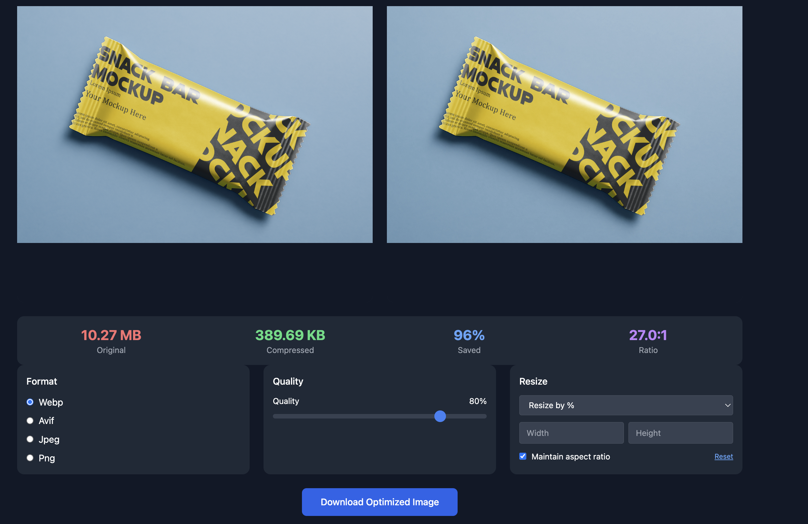
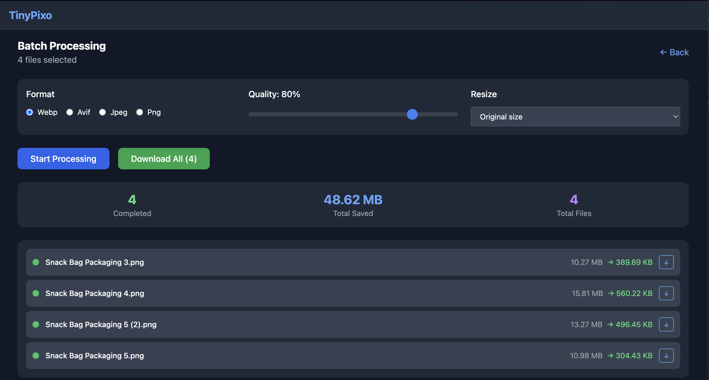
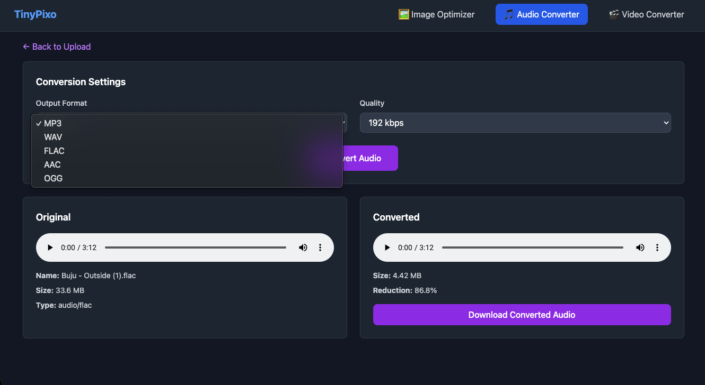
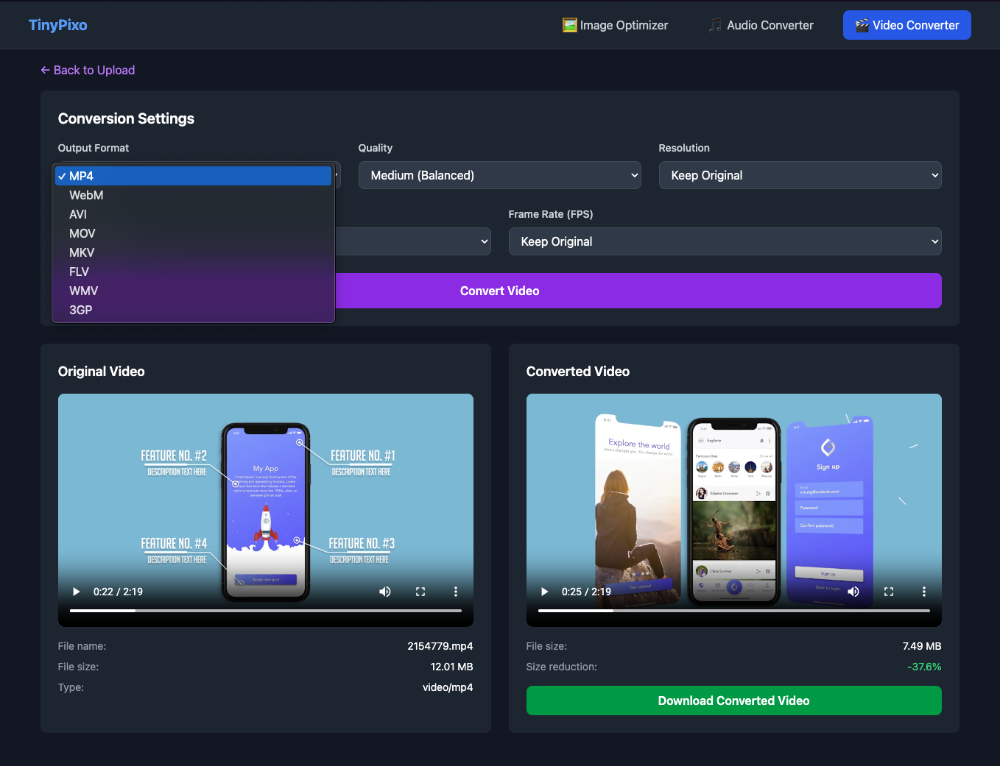

# TinyPixo - Fast and Efficient Media Optimization Web Application

TinyPixo is a modern web-based media optimization tool that enables users to compress and convert images, audio, and video to various formats while maintaining quality control. The application provides both single file and batch processing capabilities, supporting popular formats like WebP, AVIF, JPEG, PNG for images, MP3, AAC, OGG for audio, and MP4, WebM, AVI for video.

The application leverages Next.js for server-side rendering, Sharp for high-performance image processing, and FFmpeg for audio/video conversion. It offers an intuitive user interface with real-time preview capabilities, detailed compression statistics, and flexible optimization settings. Users can adjust quality levels, resize media while maintaining aspect ratios, and process multiple files simultaneously with consistent settings.

## Screenshots

### Single Image Processing

*Single image optimization interface showing before/after comparison with quality controls*

### Batch Processing

*Batch processing interface for optimizing multiple images simultaneously*

### Audio Conversion

*Audio conversion interface with format selection and quality controls*

### Video Conversion

*Video conversion interface with format, quality and resolution controls*

## Repository Structure
```
.
├── app/                          # Next.js application directory
│   ├── api/                     # API routes for media processing
│   │   ├── optimize/           # Image optimization API
│   │   ├── convert-audio/      # Audio conversion API
│   │   ├── convert-video/      # Video conversion API
│   │   └── progress/           # Real-time progress tracking API
│   ├── audio-converter/        # Audio conversion page
│   ├── video-converter/        # Video conversion page
│   ├── globals.css             # Global styles and custom slider components
│   ├── layout.tsx              # Root layout component with metadata
│   └── page.tsx                # Main application page component
├── components/                  # React components
│   ├── audio/                  # Audio conversion components
│   ├── video/                  # Video conversion components
│   ├── BatchProcessor.tsx      # Handles batch image processing
│   ├── ControlPanel.tsx        # Image optimization controls
│   ├── ImageComparison.tsx     # Side-by-side image comparison
│   └── ImageUpload.tsx         # File upload handling
├── Dockerfile                   # Multi-stage Docker build configuration
├── next.config.js              # Next.js configuration
└── package.json                # Project dependencies and scripts
```

## Usage Instructions
### Prerequisites
- Node.js 18 or later
- npm or yarn package manager
- Sharp image processing library
- FFmpeg (required for audio/video conversion)
- Docker (optional, for containerized deployment)

### Installation

#### Local Development
```bash
# Clone the repository
git clone <repository-url>
cd tinypixo

# Install dependencies
npm install

# Install FFmpeg (required for audio/video conversion)
# macOS
brew install ffmpeg
# Ubuntu/Debian
# sudo apt install ffmpeg
# Windows
# Download from https://ffmpeg.org/download.html

# Start development server
npm run dev
```

#### Docker Deployment
```bash
# Build Docker image
docker build -t tinypixo .

# Run container
docker run -p 3000:3000 tinypixo
```

#### AWS App Runner Deployment
```bash
# Build for x86_64 architecture (required for AWS)
docker build --platform linux/amd64 -t tinypixo .

# Push to Amazon ECR
aws ecr create-repository --repository-name tinypixo
aws ecr get-login-password | docker login --username AWS --password-stdin <account-id>.dkr.ecr.<region>.amazonaws.com
docker tag tinypixo:latest <account-id>.dkr.ecr.<region>.amazonaws.com/tinypixo:latest
docker push <account-id>.dkr.ecr.<region>.amazonaws.com/tinypixo:latest

# Then create App Runner service using the ECR image
# Recommended configuration: 2 vCPU / 4 GB memory
```

### Image Handling
TinyPixo processes images dynamically through its web interface. Here's what you need to know about working with images in the application:

#### Supported Formats

**Images:**
- Input: JPEG, PNG, WebP, AVIF
- Output: WebP, AVIF, JPEG, PNG

**Audio:**
- Input: MP3, WAV, FLAC, AAC, OGG
- Output: MP3, WAV, FLAC, AAC, OGG

**Video:**
- Input: MP4, WebM, AVI, MOV
- Output: MP4, WebM, AVI

#### Upload Methods
1. Drag and drop files directly onto the upload area
2. Click the upload area to select files using the system file picker
3. Batch upload multiple images simultaneously

#### Processing Capabilities

**Images:**
- Quality adjustment (1-100%)
- Format conversion
- Resize with aspect ratio preservation
- Batch processing with consistent settings

**Audio:**
- Quality/bitrate adjustment
- Format conversion
- Real-time progress tracking

**Video:**
- Quality adjustment (CRF settings)
- Resolution scaling (1080p, 720p, 480p, 360p)
- Format conversion
- FPS adjustment
- Real-time progress tracking

#### Storage Considerations
- Images are processed in-memory and not stored on the server
- Processed images must be downloaded after optimization
- Original images are only held in memory during processing

### Quick Start

#### Image Optimization
1. Access the application at `http://localhost:3000`
2. Upload an image by dragging and dropping or clicking the upload area
3. Select desired output format (WebP, AVIF, JPEG, or PNG)
4. Adjust quality settings using the slider (1-100)
5. Configure resize options if needed
6. Download the optimized image

#### Audio Conversion
1. Navigate to `http://localhost:3000/audio-converter`
2. Upload an audio file
3. Select desired output format (MP3, WAV, FLAC, AAC, OGG)
4. Adjust quality/bitrate settings
5. Click Convert and wait for processing to complete
6. Download the converted audio file

#### Video Conversion
1. Navigate to `http://localhost:3000/video-converter`
2. Upload a video file
3. Select desired output format (MP4, WebM, AVI)
4. Adjust quality, resolution, and FPS settings
5. Click Convert and monitor the progress bar
6. Download the converted video file

### More Detailed Examples

#### Image Optimization
```typescript
// Upload and optimize a single image
const handleImageUpload = async (file: File) => {
  const formData = new FormData();
  formData.append('image', file);
  formData.append('format', 'webp');
  formData.append('quality', '80');
  
  const response = await fetch('/api/optimize', {
    method: 'POST',
    body: formData
  });
  
  const optimizedImage = await response.blob();
}
```

#### Audio Conversion
```typescript
// Convert audio file
const convertAudio = async (file: File) => {
  const formData = new FormData();
  formData.append('audio', file);
  formData.append('format', 'mp3');
  formData.append('quality', '192k');
  
  const response = await fetch('/api/convert-audio', {
    method: 'POST',
    body: formData
  });
  
  // Get job ID for progress tracking
  const jobId = response.headers.get('X-Job-Id');
  
  // Poll for progress updates
  const progressInterval = setInterval(async () => {
    const progressResponse = await fetch(`/api/progress?jobId=${jobId}`);
    const data = await progressResponse.json();
    console.log(`Conversion progress: ${data.progress}%`);
    
    if (data.progress >= 100) {
      clearInterval(progressInterval);
    }
  }, 1000);
  
  const convertedAudio = await response.blob();
}
```

#### Video Conversion
```typescript
// Convert video file
const convertVideo = async (file: File) => {
  const formData = new FormData();
  formData.append('video', file);
  formData.append('format', 'mp4');
  formData.append('quality', 'medium'); // high, medium, low
  formData.append('resolution', '720p'); // 1080p, 720p, 480p, 360p, original
  formData.append('fps', 'original'); // 30, 60, original
  
  const response = await fetch('/api/convert-video', {
    method: 'POST',
    body: formData
  });
  
  const convertedVideo = await response.blob();
}
```

#### Batch Processing
```typescript
// Process multiple images with the same settings
const processBatch = async (files: File[]) => {
  const settings = {
    format: 'webp',
    quality: 80,
    width: 1920,
    height: 1080
  };
  
  for (const file of files) {
    // Process each file with the same settings
    await processImage(file, settings);
  }
};
```

### Troubleshooting

#### Common Issues

1. Image Upload Fails
```bash
# File size limits are now configured in next.config.js
export const serverExternalPackages = ['sharp']
```

2. Audio/Video Processing Error
```
FFmpeg process error: spawn ffmpeg ENOENT
```
- Ensure FFmpeg is properly installed: `brew install ffmpeg` (macOS) or `apt install ffmpeg` (Linux)
- Verify FFmpeg is in your PATH: `which ffmpeg`
- For custom FFmpeg path, set environment variable: `FFMPEG_PATH=/path/to/ffmpeg npm run dev`

3. Processing Error
- Ensure Sharp is properly installed
- Verify supported input formats
- Check server logs for detailed error messages

#### Performance Optimization
- Monitor memory usage during batch processing
- Use appropriate quality settings for different image types
- Consider implementing queue system for large batch operations

## Data Flow
TinyPixo processes media through streamlined pipelines that optimize for both performance and quality.

### Image Processing
```ascii
[Client] -> [Upload] -> [Format Selection] -> [Quality Adjustment] -> [API Route] -> [Sharp Processing] -> [Optimized Image]
```

### Audio/Video Processing
```ascii
[Client] -> [Upload] -> [Format Selection] -> [Quality Settings] -> [API Route] -> [FFmpeg Processing] -> [Progress Updates] -> [Converted Media]
```

Component Interactions:
1. Client uploads media through Upload components
2. Control panels manage optimization/conversion settings
3. API routes process media using Sharp (images) or FFmpeg (audio/video)
4. Real-time progress tracking for audio/video conversion
5. Processed media is returned to client
6. Preview components display results
7. Download functionality delivers processed media